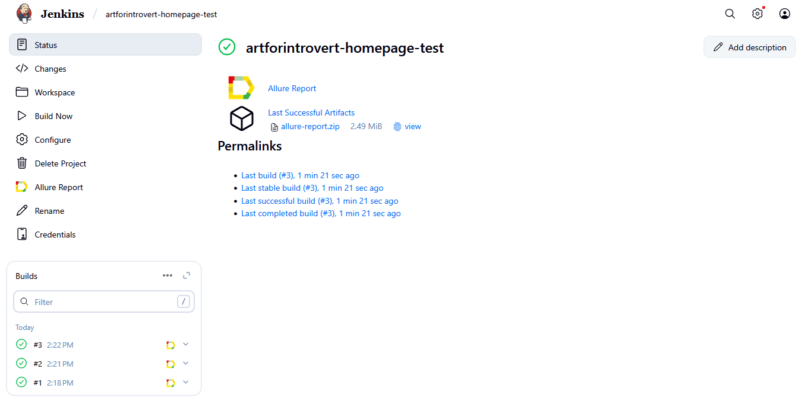
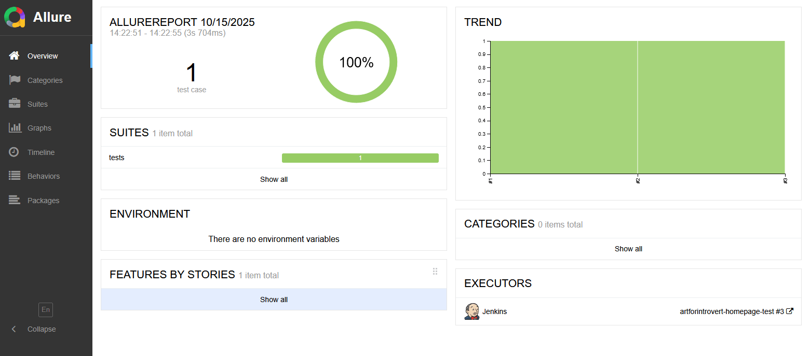
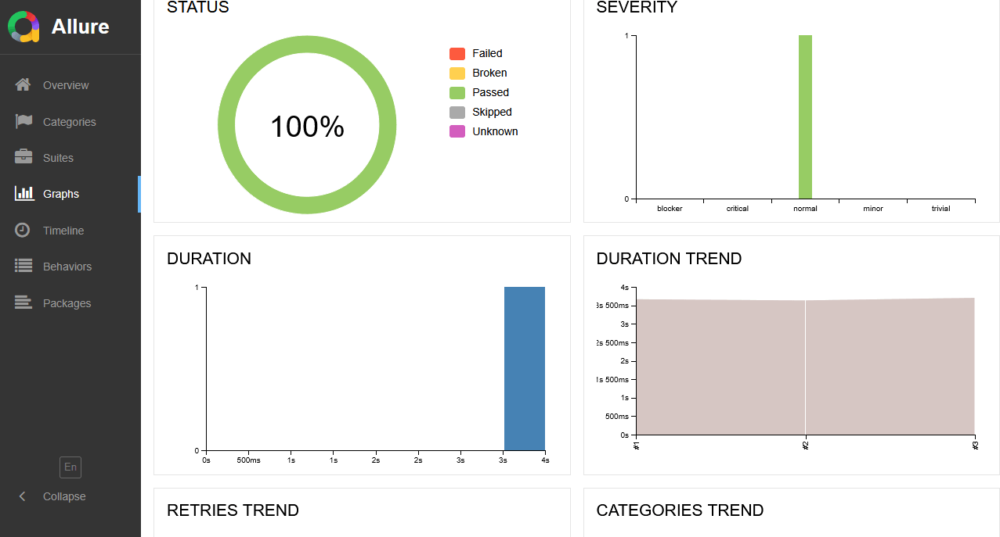
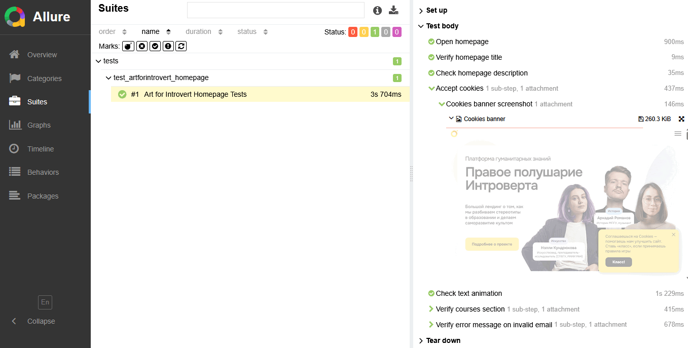
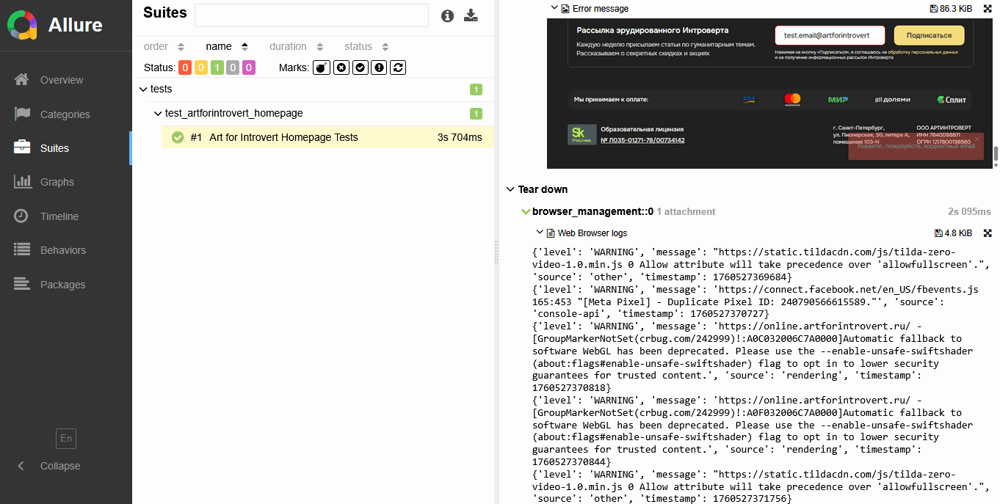
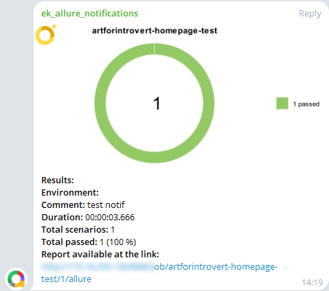

<p align="center"> 

## Проект UI автотестов домашней страницы https://online.artforintrovert.ru/

<!-- Технологии -->

### Используемые технологии/инструменты:
* Pytest
* Selene
* Allure
* Jenkins

<!-- Краткое описание -->

### Краткое описание:
Набор UI автотестов проверяет различные элементы домашней страницы компании "Правое полушарие Интроверта" - открытие страницы, meta информацию, анимированный блок с текстом, блок с курсами, а также корректную ошибку при вводе невалидного емейла на форме в футере. Тесты написаны по Page Object шаблону, результаты собираются через Allure.

<!-- Тест кейсы -->

### Что проверяем:
* Открытие домашней страницы https://online.artforintrovert.ru/
* Проверка meta: title, description
* Проверка блока с анимированным текстом: тексты, видимость, скорость анимации
* Блок c курсами: количество карточек с курсами на странице, видимость кнопок и изображений в карточках
* Футер: проверка появления корректной ошибки при введении невалидного емейла и нажатии на кнопку "Подписаться"

<!-- Jenkins -->

###  Запуск проекта в Jenkins

##### При нажатии на "Build Now" начнется сборка тестов и их прохождение:


<!-- Allure report -->

###  Allure report

##### После прохождения тестов, результаты можно посмотреть в Allure отчете:


##### Во вкладке Graphs можно посмотреть графики о прохождении тестов по их серьезности, времени прохождения, статусу и др.:


##### Во вкладке Suites находятся тест кейсы с описанными шагами, логами браузера и скриншотами:



<!-- Telegram -->

###  Интеграция с Telegram
##### После прохождения тестов, в Telegram bot приходит сообщение с графиком и небольшой информацией о тестах:


### Как запустить локально:
```bash
# создать виртуальное окружение
python -m venv venv
# активировать (Linux/macOS)
source venv/bin/activate
# (Windows)
# venv\Scripts\activate

# установить зависимости
pip install -r requirements.txt

# запустить тесты
pytest tests

# сформировать html–отчет, который откроется в браузере по умолчанию автоматически
allure serve tests/allure-results
